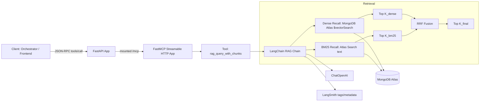
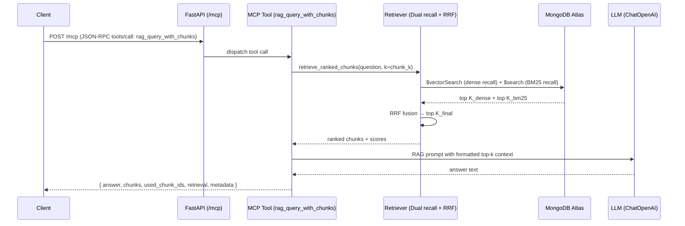

# Architecture: RAG MCP Tool Server

An LLM/RAG architecture plan for `taixingbi/mcp-tool-rag-query-v2`, based directly on the code + README.

---

## 1. What This Service Is

A RAG MCP tool server that exposes a RAG pipeline over MCP (Model Context Protocol) "streamable HTTP", mounted at `/mcp` inside a FastAPI app. It provides at least one tool:

```
rag_query_with_chunks(question, request_id?, session_id?) → returns final answer + ranked chunks + retrieval metadata
```

The service is designed so a client (orchestrator / frontend) can call it via JSON-RPC to get both:

- **LLM answer** — the generated response
- **Explainability** — ranked evidence chunks + per-chunk scores

---

## 2. High-Level Component Diagram



### Key Implementation Anchors

- FastAPI mounts MCP at `/mcp` and exposes `/health`
- Retrieval pipeline: dual recall (dense + BM25) → RRF fusion
- The RAG chain is cached per `where` filter key to avoid correctness issues

---


### Why This Design Works Well

- **Stable tool interface** — MCP allows orchestrator to treat it like any other tool
- **Debuggable evidence** — `chunks[]` includes rank, source, preview/text, and score breakdown
- **Hybrid retrieval** — Improves precision without a second vector DB or external reranker service

---

## 3. Retrieval Architecture (The Core)

### Dense Recall (MongoDB Atlas Vector Search)

- Embeds the query using OpenAI embeddings
- Runs `$vectorSearch` aggregation on the MongoDB collection with `queryVector`, `path` (embedding field), `limit` (K_dense)

### BM25 Recall (MongoDB Atlas Search)

- Runs `$search` aggregation with text query on the configured path (e.g. `text`)
- Returns top K_bm25 docs

### RRF Fusion

1. Dense recall → top K_dense docs (by chunk_id)
2. BM25 recall → top K_bm25 docs (by chunk_id)
3. Reciprocal Rank Fusion: `rrf_score += 1 / (rrf_k + rank)` per doc
4. Merge and sort by rrf_score, take top K_final

---

## 4. Generation Architecture (LLM Chain)

The LangChain chain structure:

```
context = retriever(where) | format_docs
```

- **Prompt:** Strict instruction — answer only from provided context; if missing, say so; don't make up facts
- **Model:** `ChatOpenAI(model=settings.openai_model, temperature=0, timeout=30, max_retries=2)`
- **Output:** `StrOutputParser()`

**Important:** The chain is cached per `where` key (`_rag_chain_cache` keyed by `_where_key(where)`), which prevents cross-tenant/filter leakage.

---

## 5. Observability Hooks (LangSmith)

- **Tags:** `app_version`, `mcp_name`, plus `request_id`, `session_id` when provided
- **Run config:** `run_name=settings.mcp_name` so traces group by service/tool
- **Metadata:** `metadata={"reranked_chunks": chunks}` is passed into trace config so evidence is attached to the run

---

## 6. Public API Surface

### Health

| Endpoint    | Description                                                |
|------------|------------------------------------------------------------|
| `GET /health` | Returns status plus key runtime config (mcp name/version + mongodb info) |

### MCP Tool

`rag_query_with_chunks(...)` returns a payload shaped like:

| Field      | Description                          |
|-----------|--------------------------------------|
| `metadata` | `{ reranked_chunks: [...] }`        |
| `data`     | `{ question, answer }`              |
| (internal) | `chunks`, `used_chunk_ids`, `retrieval {k, alpha, filters, warnings}` |

---

## 7. README-Ready Architecture Summary

Copy-paste this section as-is for README or design docs:

### Service Overview

This repository implements a Retrieval-Augmented Generation (RAG) microservice exposed as an MCP (Model Context Protocol) tool server over HTTP. A FastAPI application mounts a FastMCP streamable HTTP app under `/mcp`, enabling JSON-RPC tool invocation from an orchestrator or frontend.

### Retrieval Pipeline

The service uses MongoDB Atlas for both dense and BM25 recall. Dense recall uses Atlas Vector Search (`$vectorSearch`); BM25 recall uses Atlas Search (`$search` text). Each query is embedded using OpenAI embeddings for dense search. Results are fused with Reciprocal Rank Fusion (RRF): `rrf_score = Σ 1/(rrf_k + rank)` across both lists, then sorted by rrf_score to produce the top K_final chunks.

### Generation Pipeline

Retrieved chunks are formatted into a context block and passed to a LangChain RAG prompt that instructs the model to answer strictly from provided context and to abstain when evidence is missing. The LLM call uses deterministic settings (temperature 0) with timeouts and retries.

### Explainability & Debugging

The main tool returns both the final answer and the ranked chunk list, including per-chunk score breakdown (dense distance, BM25 scores, normalized values, and fused hybrid score). The service also returns `used_chunk_ids` to indicate which evidence chunks were used in generation.

### Tracing / Observability

LangSmith tags (e.g., app version, MCP name, request/session IDs) and retrieval metadata are attached to each run for debugging and evaluation workflows.

---


## 8. Request/Response Lifecycle (End-to-End)

